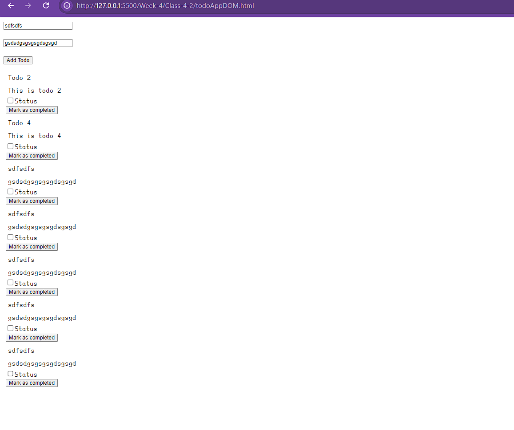

# Todo App

### todoAppDOM.html
This is a simple Todo App that allows users to add, mark as completed, and update todo items. It's built with HTML, CSS, and JavaScript.

### TodoAppDiff.html
This is a simple Todo App built with HTML, CSS, and JavaScript. It allows users to add, remove, and update todos. The todos are fetched from an API and displayed on the page.

## Features

### todoAppDOM.html
- Add new todo items
- Mark todo items as completed
- Update todo items
- Fetch todo items from the server every 5 seconds and update the DOM

### TodoAppDiff.html
- Add a new todo
- Remove an existing todo
- Update the status of a todo
- Fetch todos from an API

## Installation

To use this app, simply download the HTML file and open it in your web browser.

## Usage

Enter a title and description for your todo item in the input fields and click the "Add Todo" button to add a new todo item.

### TodoDiff.html
Open the `TodoAppDiff.html` file in your web browser to start using the app.

## Author

[KitsuneKode](https://github.com/KitsuneKode)

## License

This project is licensed under the MIT License - see the [LICENSE](LICENSE) file for details.

## Contributing

1. Fork the project.
2. Create your feature branch (`git checkout -b feature/AmazingFeature`).
3. Commit your changes (`git commit -m 'Add some AmazingFeature'`).
4. Push to the branch (`git push origin feature/AmazingFeature`).
5. Open a pull request.

Please make sure to update tests as appropriate.

## Acknowledgments

-Learnt from [Harkirat Singh](https://github.com/hkirat) and his course [0-100x-Dev](https://harkirat.classx.co.in/)
