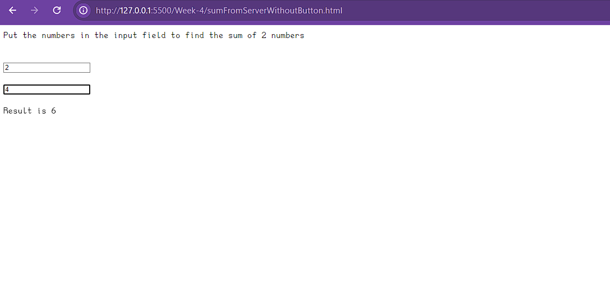
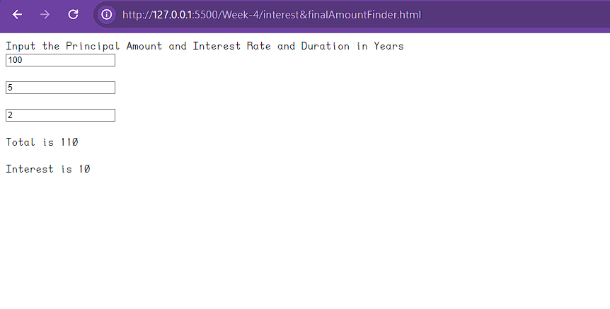

# Interest Calculator

This project is a simple interest calculator. It includes a backend service and two HTML files for user interaction.

## Functionality

The backend service exposes an endpoint `/interestCalculator` that accepts GET requests. The request should include `principal`, `rate`, and `time` as query parameters. The service calculates the interest and total amount based on these parameters and returns them in the response.

The HTML files `index.html` and `interest&finalAmountFinder.html` collect Principal, Rate, and Time from the user, send these values to the backend service, and display the results.

## Usage

Open `index.html` or `interest&finalAmountFinder.html` in a web browser and enter the Principal, Rate, and Time. The calculated interest and total amount will be displayed.

## Files

- `interestFinderBackend.js`: This is the backend service for the interest calculator.
- `index.html`: This is the main HTML file for user interaction.
- `interest&finalAmountFinder.html`: This is an additional HTML file for user interaction.

## Screenshots

Here are the screenshots of the sum and interest:

## Author

[KitsuneKode](https://github.com/KitsuneKode)

## License

This project is licensed under the MIT License - see the [LICENSE.md](LICENSE.md) file for details
