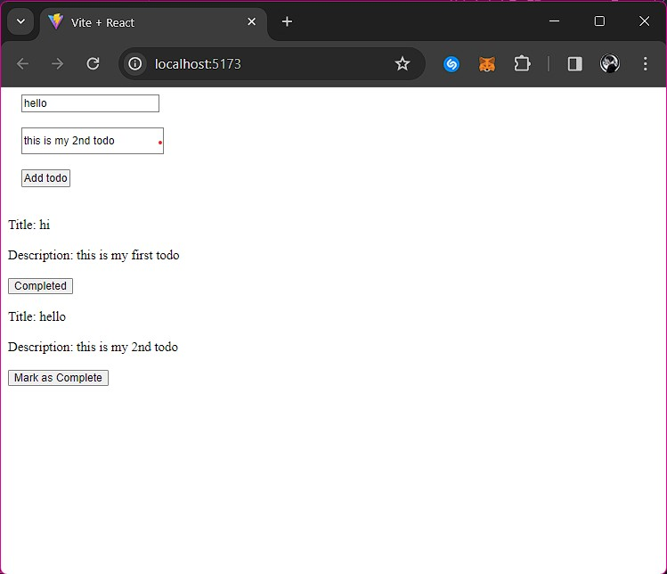

# Todo App Using React 

This project is a Todo Application built with a frontend and backend. It allows users to add todos with a title and description, and displays the list of todos. Each todo item has a status that can be toggled between 'Completed' and 'Not Completed'. This application is a great way to keep track of tasks and their completion status.

## Getting Started
 
To get a local copy up and running, follow these steps:

1. Clone the repository: 
2. Navigate to the project directory: `cd Todo_App_React&Express`
3. Install the dependencies: `npm install`

## Usage

To run the backend, use the command: `npm start`
To run the frontend, use the command: `npm run dev`

This will start the development server. You can view the application in your browser at `h      ttp://localhost:3000`.

## Features

### Frontend

- React.js: Used for building the user interface.
- React Hooks: Used for managing state and side effects in functional components.
- React Router: Used for routing and navigation in the application.

### Backend

- Node.js: Used for the backend server.
- Express.js: Used for handling HTTP requests and responses.
- MongoDB: Used as the database for storing todos.

## Contributing

Pull requests are welcome. For major changes, please open an issue first to discuss what you would like to change.

## License

This project is licensed under the MIT License. See the [LICENSE](LICENSE) file for details.

## Author

- [KitsuneKode](https://github.com/KitsuneKode)
